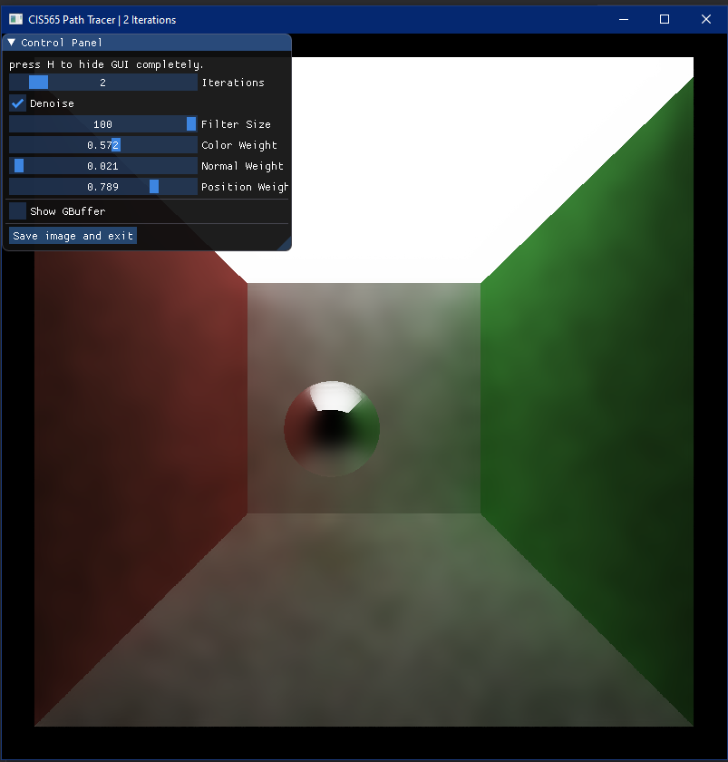

项目4 CUDA去噪器 - 说明文档
=======================================

截止日期：**10月20日周五** 美国东部时间晚上11:59

**概述：**

在这个项目中，您将实现一个使用几何缓冲区（G-buffers）来指导平滑滤波器的路径追踪去噪器。

我们希望您基于论文"用于快速全局光照滤波的边缘避免A-Trous小波变换"（Edge-Avoiding A-Trous Wavelet Transform for fast Global Illumination Filtering）来实现技术，作者为Dammertz、Sewtz、Hanika和Lensch。
您可以在此处找到论文：https://jo.dreggn.org/home/2010_atrous.pdf

去噪器可以帮助在较少的每像素采样数/迭代次数下，在路径追踪图像中产生更平滑的外观，尽管实际改善效果通常因场景而异。
可以通过模糊像素来实现图像的平滑 - 简单的逐像素模糊滤波器可能会从图像中像素的邻居采样颜色，按距离加权，并将结果写回像素。

然而，在图像上简单运行模糊滤波器通常会减少细节量，平滑锐利边缘。随着模糊滤波器变大或模糊次数增加，这种情况可能会变得更糟。
幸运的是，在3D场景中，我们可以使用每像素度量来帮助滤波器检测和保留边缘。

| 原始路径追踪图像 | 简单模糊 | G-buffer引导的模糊 |
|---|---|---|
||||

这些每像素度量可以包括场景几何信息（因此称为G-buffer），例如每像素法线和每像素位置，以及用于保留映射或程序纹理细节的表面颜色或反照率。在本作业中，我们只需要来自"第一次反弹"的每像素度量。

| 每像素法线 | 每像素位置（缩小显示） | ???！（虚拟数据，飞行时间）|
|---|---|---|
||||

## 基于项目3 CUDA路径追踪器构建

**我们强烈建议您将去噪集成到您的项目3 CUDA路径追踪器中。**

此项目的基础代码从项目3中的CUDA路径追踪器基础代码分叉而来，存在的目的是使作业能够独立存在，同时为如何实现一些有用的工具提供指导。
主要变化是我们添加了一些GUI控制、一个*非常*简单的无流压缩的路径追踪器，以及包含一些虚拟数据的G-buffer。

您可以选择使用此项目中的基础代码作为参考、游乐场或作为去噪器的基础代码。将其用作参考或游乐场将允许您了解集成去噪器所需的更改。
与项目3一样，您也可以随意更改基础代码的任何部分。**这是您的项目。**

### 使用Git工作

我们期望您们大多数人将去噪器集成到项目3中。因此，以下是我们希望您处理Git/GitHub工作的方式，因为GitHub不允许您从项目3向项目4开启拉取请求。

1. 像您对所有其他项目所做的那样分叉项目4。您可以自由使用之前讨论过的基础代码。
2. 在您的项目3仓库中，使用`git checkout -b denoiser`创建一个名为`denoiser`的分支。将此作为您的主要去噪器分支，您可以根据需要创建任意数量的附加分支。
3. 您将在项目3中构建去噪器直到提交。
4. 当您准备提交项目时，请执行以下操作：
    1. 使用`git remote add project4 git@github.com:<your-username>/Project4-CUDA-Denoiser.git`添加您的项目4分叉作为远程（您可以用`https://github.com/`替换`git@github.com:`）。
    2. 使用`git push project4 denoiser`将您的去噪器分支推送到项目4。这里`project4`是远程仓库，`denoiser`是您用于提交的分支。
    3. 在GitHub上打开您的项目4仓库，确认您刚刚推送的分支存在。
    4. 在浏览器中打开[https://github.com/CIS565-Fall-2023/Project4-CUDA-Denoiser](https://github.com/CIS565-Fall-2023/Project4-CUDA-Denoiser)，并开启一个拉取请求，其中源分支是您在GitHub中的分支。
5. 所有其他提交和开启拉取请求的说明与其他项目保持一致。请参见本文档末尾的提交部分。

## 内容

* `src/` C++/CUDA源文件。
* `scenes/` 示例场景描述文件。
* `img/` 示例场景描述文件的渲染图。（这些可能与您的不完全匹配。）
  * 注意我们添加了一个`cornell_ceiling_light`场景
  * 简单的路径追踪器通常受益于具有非常大光源的场景
* `external/` 第三方库的包含文件和静态库。
* `imgui/` 来自https://github.com/ocornut/imgui的库代码

## 运行代码

主函数需要一个场景描述文件。使用一个作为参数调用程序：`cis565_denoiser scenes/cornell_ceiling_light.txt`。（在Visual Studio中，`../scenes/cornell_ceiling_light.txt`。）

如果您使用Visual Studio，可以在`项目属性`的`调试 > 命令参数`部分设置这个。确保路径正确 - 查看控制台的错误信息。

### 控制

* Esc 保存图像并退出。
* S 保存图像。观察控制台的输出文件名。
* 空格键 将相机重新居中到原始场景的lookAt点。
* 左鼠标按钮 旋转相机。
* 右鼠标按钮 在垂直轴上放大/缩小。
* 中鼠标按钮 在场景的X/Z平面中移动LOOKAT点。

我们还添加了简单的GUI控制，可以更改代码中的变量，让您无需重新编译项目即可调整去噪参数。

要求
===

**在Ed中询问澄清。**

## 第1部分 - 阅读！

此项目的一个元目标是帮助您获得阅读技术论文并实现其概念的经验。这是图形软件工程中的重要技能，对您的最终项目也很有帮助。

对于第一部分，尝试浏览论文，然后深入阅读几次：https://jo.dreggn.org/home/2010_atrous.pdf

尝试查找您不理解的任何内容，并随时在Ed上与您的同学讨论。我们还能够找到此论文的演示幻灯片，可能会有所帮助：https://www.highperformancegraphics.org/previous/www_2010/media/RayTracing_I/HPG2010_RayTracing_I_Dammertz.pdf

这篇论文还很有帮助，因为它包含了一个代码示例，说明了一些数学，尽管并未给出所有细节 - 例如，去噪中的参数调整可能非常依赖于实现。

此项目将专注于这篇论文，但是，阅读一些参考文献以及关于去噪的更新论文也可能会有帮助，例如NVIDIA的"时空方差引导滤波"（Spatiotemporal Variance-Guided Filtering），可在此处获得：https://research.nvidia.com/publication/2017-07_Spatiotemporal-Variance-Guided-Filtering%3A

## 第2部分 - A-trous小波滤波器

从论文中实现A-trous小波滤波器。:shrug:

将技术分解为您可以单独验证的步骤总是好的。
此论文的这种分解可能包括：
1. 向您的项目添加UI控制 - 我们在此基础代码中为您完成了这项工作，但请参见`基础代码导览`
1. 为法线和位置实现G-Buffers并可视化它们以确认（请参见`基础代码导览`）
1. 实现A-trous内核及其迭代而不加权，并与从GIMP或Photoshop应用的模糊进行比较
1. 使用G-Buffers保留感知边缘
1. 调整参数以查看它们是否以您期望的方式响应
1. 测试更高级的场景

## 基础代码导览

此基础代码源自项目3。一些显著差异：

* `src/pathtrace.cu` - 我们添加了函数`showGBuffer`和`showImage`来帮助您可视化G-Buffer信息和去噪结果。在`pathtrace`的第一次反弹中还有一个`generateGBuffer`内核。
* `src/sceneStructs.h` - 有一个新的`GBufferPixel`结构
  * G-buffer这个术语在OpenGL或WebGL等光栅化API世界中更常见，在那里由于有限的像素通道（RGB、RGBA），可能需要许多G-buffer
  * 在CUDA中，我们可以将所有内容打包到一个G-buffer中，像素相对巨大。
  * 目前这只包含一些虚拟的"相交时间"数据，以便您可以看到`showGBuffer`的工作原理。
* `src/main.h`和`src/main.cpp` - 我们添加了一堆`ui_`变量 - 这些连接到`src/preview.cpp`中的UI滑块，让您在`showGBuffer`和`showImage`之间切换等。
* `scenes` - 我们添加了`cornell_ceiling_light.txt`，它使用更大的光源和更少的迭代。这可能是开始去噪的好场景，因为即使在第一次迭代中，许多光线也会在光源处终止。
* 像往常一样，请务必在项目中搜索`CHECKITOUT`和`TODO`

请注意，图像保存功能尚未连接到gbuffers或去噪图像 - 您可能需要自己完成此操作，但这样做比截屏每张图像要方便得多。

还有几个特定的git提交，您可以查看以获得如何向自己的路径追踪器添加其中一些更改（例如`imgui`）的指导。您可以使用`git diff [commit hash]`在命令行上查看这些更改，或在github上查看，例如：https://github.com/CIS565-Fall-2023/Project4-CUDA-Denoiser/commit/0857d1f8f477a39a9ba28a1e0a584b79bd7ec466

* [0857d1f8f477a39a9ba28a1e0a584b79bd7ec466](https://github.com/CIS565-Fall-2023/Project4-CUDA-Denoiser/commit/0857d1f8f477a39a9ba28a1e0a584b79bd7ec466) - 具有虚拟数据作为相交时间的gbuffer可视化代码
* [1178307347e32da064dce1ef4c217ce0ca6153a8](https://github.com/CIS565-Fall-2023/Project4-CUDA-Denoiser/commit/1178307347e32da064dce1ef4c217ce0ca6153a8) - 向UI添加迭代滑块和保存并退出按钮
* [5feb60366e03687bfc245579523402221950c9c5](https://github.com/CIS565-Fall-2023/Project4-CUDA-Denoiser/commit/5feb60366e03687bfc245579523402221950c9c5) - 添加imgui并设置去噪参数的基本滑块（所有令人痛苦的cmake更改）

## 第3部分 - 性能分析

去噪的目的是减少获得可接受平滑图像所需的每像素采样数/路径追踪迭代次数。您应该为以下内容提供分析和图表：
* 去噪为您的渲染添加了多少时间
* 去噪如何影响获得"可接受平滑"结果所需的迭代次数
* 不同分辨率下的去噪如何影响运行时间
* 不同滤波器大小如何影响性能

除了上述内容外，您还应该在定性水平上分析您的去噪器：
* 视觉结果如何随滤波器大小变化 -- 视觉质量是否与滤波器大小均匀缩放？
* 此方法对不同材质类型的效果如何
* 不同场景间的结果如何比较 - 例如，在`cornell.txt`和`cornell_ceiling_light.txt`之间。一个场景是否产生更好的去噪结果？为什么或为什么不？

请注意，"可接受平滑"在某种程度上是主观的 - 我们将图像比较的方法留给您，但图像差异工具可能是一个好的起点，可以帮助直观地传达两张图像之间的差异。

额外学分
===

以下额外学分项目大致按努力程度排列，只是建议 - 如果您有其他想要添加的想法，只需在Ed上询问！

## G-Buffer优化

开始使用gbuffers时，最简单的方法可能是开始将每像素位置和法线存储为glm::vec3。但是，这可能是相当大量的每像素数据，必须从内存中读取。

实现更紧凑地存储位置和法线的方法。两个起点包括：
* 存储Z深度而不是位置，并基于像素坐标和反向投影矩阵重建位置
* oct编码法线：http://jcgt.org/published/0003/02/01/paper.pdf

确保提供优化和未优化实现之间的性能比较数字。

## 比较A-trous和高斯滤波

Dammertz等人在其第2.2节中提到A-trous滤波是近似高斯滤波的一种方法。实现高斯滤波并与A-trous比较，看看一种方法是否明显更快。还要注意结果中的任何视觉差异。

## 共享内存滤波

滤波技术可能有些内存昂贵 - 对于每个像素，该技术读取几个相邻像素以计算最终值。这只会随着G-Buffers中的附加数据变得更昂贵，因此这些技术可能会从共享内存中受益。

确保提供有无共享内存实现之间的性能比较数字。
还要注意共享内存使用如何影响内核的块大小，以及随着滤波器宽度变化这可能如何改变。

## 实现时间采样

动态应用程序（如游戏或实时可视化引擎）中的高性能光线追踪器现在经常使用时间采样，从先前帧借用和重新定位样本，以便每帧有效地只计算1个每像素样本，但可以从许多帧中去噪。

这将需要额外的缓冲区，以及重投影代码来将样本从先前帧中的位置移动到当前帧。

请注意，我们的基本路径追踪器不做动画，因此您还需要在场景中实现某种动态方面 - 这可能简单如自动平移相机，也可能复杂如平移模型。

有关更多详细信息，请参见https://research.nvidia.com/publication/2017-07_Spatiotemporal-Variance-Guided-Filtering%3A。

提交
===

如果您修改了任何`CMakeLists.txt`文件（除了`SOURCE_FILES`列表），请明确提及。注意Ed上讨论的任何构建问题。

开启GitHub拉取请求，以便我们可以看到您已完成。

标题应为"Project 4: YOUR NAME"。
拉取请求评论部分的模板附在下面，您可以复制和粘贴：

* [仓库链接](https://link-to-your-repo)
* （简要）提及您已完成的功能。特别是您想要突出显示的那些亮点
    * 功能0
    * 功能1
    * ...
* 对项目本身的反馈（如有）。

参考文献
===

* [用于快速全局光照滤波的边缘避免A-Trous小波变换](https://jo.dreggn.org/home/2010_atrous.pdf)
* [时空方差引导滤波](https://research.nvidia.com/publication/2017-07_Spatiotemporal-Variance-Guided-Filtering%3A)
* [独立单位向量高效表示的调查](http://jcgt.org/published/0003/02/01/paper.pdf)
* ocornut/imgui - https://github.com/ocornut/imgui 